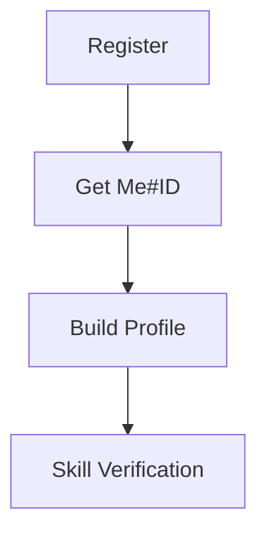
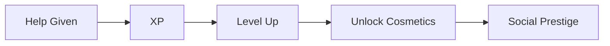

# Functional Requirements

## User Management

## Help Interactions
1. **Request Help**
   - Tag skills needed
   - Set urgency level
2. **Provide Help**
   - Solution submission
   - Rating received
   - Chain inheritance

## Session Handling
- **First Visit:** Assign temporary Me#ID stored in session cookie
- **Authentication:** 
  - Email/password or OAuth login
  - Merge temporary ID with permanent account
- **Returning Users:** Restore session from cookie

## Game Systems

## Database Requirements
- SQLite-compatible schema design
- JSON1 extension for skill storage
- Migration-ready structure
